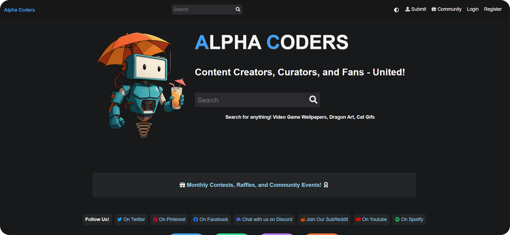

  

  <h1>تنزيل Alphacoders الفوري</h1>

  

    <strong>تخطى انتظار 5 ثواني عند تحميل الملفات المجانية من Alphacoders.</strong>
  

  

    
    
    
  

  

## نبذة

Alphacoders موقع كبير للخلفيات، الصور، الأفاتار، خلفيات الجوال، والـGIFs. هذه الإضافة تجعل زر **Free Download** يبدأ التحميل مباشرة في الصفحات المدعومة بدل انتظار عداد 5 ثواني.

## الأقسام المدعومة

`alphacoders.com` / `wall.alphacoders.com` / `avatars.alphacoders.com` / `mobile.alphacoders.com` / `gifs.alphacoders.com`

## التثبيت

1. حمل ملف `alphacoders-instant-download-v1.0.0.zip` من [آخر إصدار](https://github.com/voidksa/alphacoders-instant-download-extension/releases/tag/v1.0.0).
2. فك الضغط عن الملف.
3. افتح `chrome://extensions` أو `edge://extensions`.
4. فعل **Developer mode** ثم اضغط **Load unpacked** واختر مجلد الإضافة.

## الاستخدام

افتح أي صفحة صورة مدعومة في Alphacoders، فعل **Instant Download** من نافذة الإضافة، ثم اضغط **Free Download**.

## ملاحظة

الإضافة لا تغير صلاحيات الحساب. وظيفتها فقط تخطي عداد الانتظار الموجود في المتصفح عندما يكون رابط التحميل المجاني متاحًا.
